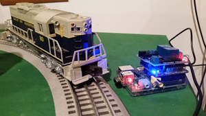

## **Arduberry Project: Lionel Train Control with the Raspberry Pi**
This project combines the brains of a Raspberry Pi with the brawn of an Arduino.  Read more about it here:  http://www.dexterindustries.com/Arduberry

## Lionel Train Control with the Raspberry Pi

This project code is for controlling Lionel Trains with the Raspberry Pi.  See more about this project [on the project page here.] (https://www.dexterindustries.com/Arduberry/example-projects-with-arduberry-and-raspberry-pi/)

[Dexter Industries](http://www.dexterindustries.com/).
[http://www.dexterindustries.com/Arduberry] (http://www.dexterindustries.com/Arduberry)

These files have been made available online through a [Creative Commons Attribution-ShareAlike 3.0](http://creativecommons.org/licenses/by-sa/3.0/) license.
